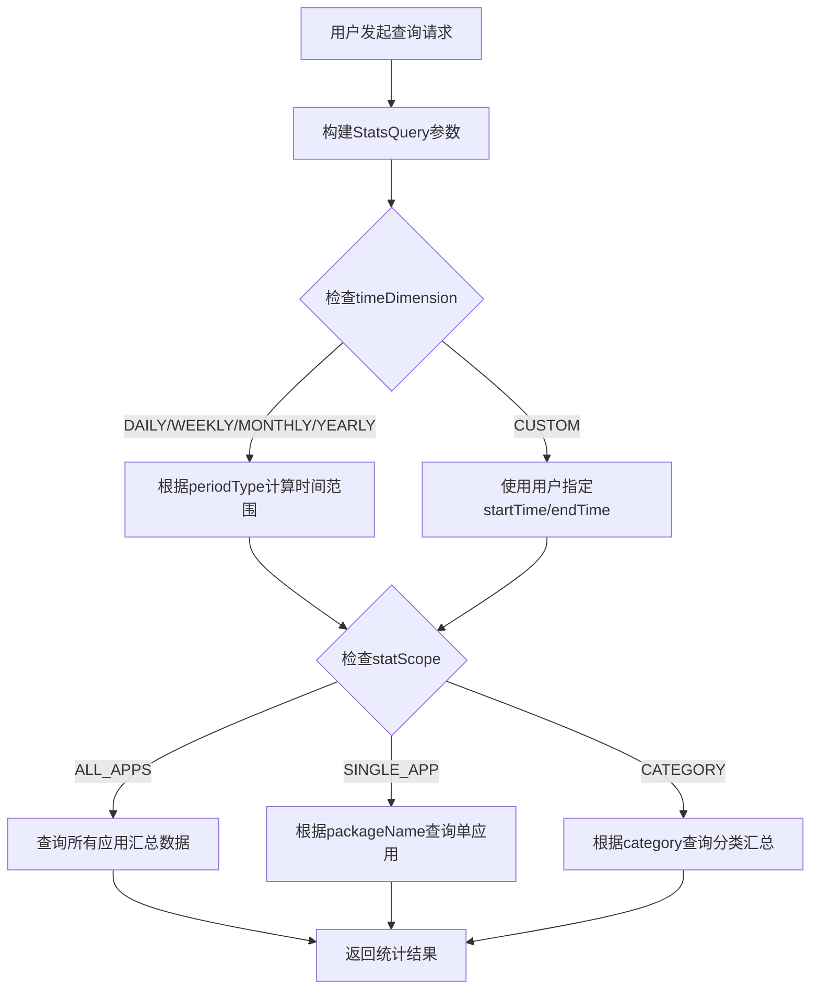

# 时间都去哪了 - 统一术语表 v2.3

> **版本：** v2.3  
> **更新日期：** 2025-10-15  
> **用途：** 统一项目中所有文档、代码、UI的术语，避免歧义  
> **权威来源：** 本文档为最终术语标准  
> **更新说明：** 新增多时间维度统计能力，支持日/周/月/年/自定义维度查询，增加任意指定的单app应用统计支持

---

## 🎯 四大核心指标（基础统计层）

| 序号 | 中文术语 | 英文字段名 | 数据类型 | Emoji | 数据来源 | 计算方式 | 说明 |
|------|---------|-----------|---------|-------|---------|---------|------|
| 1 | 今日屏幕时长 | `totalScreenTime` | Long (毫秒) | 📱 | screen_event表 | SCREEN_ON/OFF配对计算 | 屏幕从亮起到熄灭的总时长（最大指标） |
| 2 | 手机解锁次数 | `phoneUnlockCount` | Int | 🔓 | screen_event表 | COUNT(USER_PRESENT事件) | 用户解锁设备的次数（设备层面） |
| 3 | APP打开次数 | `appOpenCount` | Int | 📲 | app_session表 | COUNT(*) | APP切换到前台的总次数（应用层面） |
| 4 | APP使用时长 | `appUsageDuration` | Long (毫秒) | 🔆 | app_session表 | SUM(duration) | 所有APP在前台运行的总时长 |

### 核心指标关系

```
关系1（恒成立）：
  totalScreenTime >= appUsageDuration
  说明：屏幕时长包括应用使用+桌面+系统界面

关系2（无必然大小关系）：
  phoneUnlockCount 与 appOpenCount 无固定大小关系
  - 常见：phoneUnlockCount < appOpenCount（一次手机解锁后打开多个APP）
  - 特殊：phoneUnlockCount > appOpenCount（只解锁查看通知，不打开APP）
  - 极端：appOpenCount = 0（只解锁手机，完全不打开APP）
```

---

## 📊 数据层次架构

### 🏠 基础统计层（必需）

仅包含四大核心指标所需的最小数据集，用于日常统计和显示。

### 🔍 高级分析层（可选）

包含详细的行为分析数据，用于深度洞察和用户行为分析。

---

## 📦 核心数据模型（基础统计层）

### AppSession（应用会话）

| 中文字段 | 字段名（Kotlin） | SQL字段名 | 类型 | 说明 |
|---------|---------|---------|------|------|
| 会话ID | `sessionId` | `session_id` | String | 每次会话的唯一标识（UUID） |
| 包名 | `packageName` | `package_name` | String | 应用包名，如 com.tencent.mm |
| 应用名 | `appName` | `app_name` | String | 应用中文名，如"微信" |
| 应用分类 | `category` | `category` | AppCategory | 应用分类（社交、娱乐等） |
| 开始时间 | `startTime` | `start_time` | Long | 会话开始时间戳（毫秒） |
| 结束时间 | `endTime` | `end_time` | Long | 会话结束时间戳（毫秒） |
| 使用时长 | `duration` | `duration` | Long | 本次会话时长（毫秒，≥0） |
| 切换次数 | `switchCount` | `switch_count` | Int | 本会话内的前后台切换次数 |
| 触发方式 | `triggerType` | `trigger_type` | TriggerType | 会话触发方式（用户启动/系统触发等） |
| 退出方式 | `exitType` | `exit_type` | ExitType | 会话退出方式（用户退出/系统终止等） |
| 收集模式 | `collectionMode` | `collection_mode` | PerformanceMode | 数据收集模式（标准/高精度/省电） |
| 设备状态 | `deviceState` | `device_state` | DeviceState | 设备状态（正常/充电/低电量等） |
| 创建时间 | `createdAt` | `created_at` | Long | 记录创建时间 |
| 更新时间 | `updatedAt` | `updated_at` | Long | 记录更新时间 |

**统计原则：**

- ✅ 每次APP从后台切换到前台 → 生成新的`app_session`记录
- ✅ APP打开次数 = `COUNT(*)`统计记录数
- ✅ APP使用时长 = `SUM(duration)`统计总时长
- ✅ `< 1秒的会话：保存记录但duration设为0`（行为记录，时长过滤）

### ScreenEvent（屏幕事件）

| 中文字段 | 字段名 | 类型 | 说明 |
|---------|--------|------|------|
| 事件ID | `eventId` | String | 每次事件的唯一标识（UUID） |
| 事件类型 | `eventType` | ScreenEventType | SCREEN_ON, SCREEN_OFF, USER_PRESENT |
| 时间戳 | `timestamp` | Long | 事件发生时间戳（毫秒） |

### StatsQuery（统计查询参数）

用于灵活的多维度数据查询。

| 中文字段 | 字段名 | 类型 | 说明 |
|---------|--------|------|------|
| 时间维度 | `timeDimension` | TimeDimension | 时间粒度：DAILY/WEEKLY/MONTHLY/YEARLY/CUSTOM |
| 开始时间 | `startTime` | Long | 查询开始时间戳（毫秒），CUSTOM时必填 |
| 结束时间 | `endTime` | Long | 查询结束时间戳（毫秒），CUSTOM时必填 |
| 统计范围 | `statScope` | StatScope | 统计范围：ALL_APPS/SINGLE_APP/CATEGORY |
| 应用包名 | `packageName` | String? | SINGLE_APP时必填，其他为null |
| 应用分类 | `category` | AppCategory? | CATEGORY时必填，其他为null |
| 周期类型 | `periodType` | PeriodType? | 预定义周期（可选，如TODAY、THIS_WEEK等） |

**查询场景示例**：

| 场景描述 | timeDimension | periodType | statScope | packageName | category | 说明 |
|---------|---------------|-----------|-----------|-------------|----------|------|
| 查询今日所有应用 | DAILY | TODAY | ALL_APPS | null | null | 今日整体使用情况 |
| 查询本周微信数据 | WEEKLY | THIS_WEEK | SINGLE_APP | com.tencent.mm | null | 本周微信使用详情 |
| 查询本月社交类应用 | MONTHLY | THIS_MONTH | CATEGORY | null | SOCIAL | 本月社交类使用 |
| 自定义时间段全局统计 | CUSTOM | null | ALL_APPS | null | null | 需提供startTime/endTime |

**查询流程**：



### TimeRange（时间范围）

用于表示查询的时间范围。

| 中文字段 | 字段名 | 类型 | 说明 |
|---------|--------|------|------|
| 开始时间 | `startTime` | Long | 开始时间戳（毫秒） |
| 结束时间 | `endTime` | Long | 结束时间戳（毫秒） |
| 维度类型 | `dimension` | TimeDimension | 时间维度类型 |

**业务规则**：
- `endTime >= startTime`（必须满足）
- 时间范围的计算遵循所属维度的定义规则
- DAILY：按自然日（00:00:00 - 23:59:59）
- WEEKLY：按自然周（周一00:00 - 周日23:59）
- MONTHLY：按自然月（1日00:00 - 月末23:59）
- YEARLY：按自然年（1月1日00:00 - 12月31日23:59）
- CUSTOM：用户自定义

---

## 🔤 基础枚举类型

### ScreenEventType（屏幕事件类型）

用于基础统计，支持四大核心指标计算。

| 枚举值 | 中文名 | 说明 | 使用场景 |
|--------|--------|------|---------|
| `SCREEN_ON` | 屏幕点亮 | 屏幕从熄灭到亮起 | 计算totalScreenTime |
| `SCREEN_OFF` | 屏幕熄灭 | 屏幕从亮起到熄灭 | 计算totalScreenTime |
| `USER_PRESENT` | 用户解锁 | 用户成功解锁设备 | 计算phoneUnlockCount |

### TimeDimension（时间维度类型）

用于多维度统计查询和数据聚合。

| 枚举值 | 中文名 | 说明 | 时间范围定义 | 使用场景 |
|--------|--------|------|-------------|---------|
| `DAILY` | 日维度 | 按自然日统计 | 00:00:00 - 23:59:59 | 今日、昨日统计 |
| `WEEKLY` | 周维度 | 按自然周统计 | 周一00:00 - 周日23:59 | 本周、上周统计 |
| `MONTHLY` | 月维度 | 按自然月统计 | 1日00:00 - 月末23:59 | 本月、上月统计 |
| `YEARLY` | 年维度 | 按自然年统计 | 1月1日00:00 - 12月31日23:59 | 本年、去年统计 |
| `CUSTOM` | 自定义 | 用户指定时间范围 | startTime - endTime | 自定义范围查询 |

### StatScope（统计范围类型）

用于指定统计的应用范围。

| 枚举值 | 中文名 | 说明 | 应用场景 |
|--------|--------|------|---------|
| `ALL_APPS` | 全部应用 | 统计所有应用的汇总数据 | 总体使用情况分析 |
| `SINGLE_APP` | 单个应用 | 统计指定包名的应用数据 | 单个应用详情分析 |
| `CATEGORY` | 应用分类 | 按应用分类统计 | 分类使用情况分析 |

### PeriodType（统计周期类型）

用于预定义的常用统计周期。

| 枚举值 | 中文名 | 说明 | 使用场景 |
|--------|--------|------|---------|
| `TODAY` | 今日 | 当前自然日 | 实时统计 |
| `YESTERDAY` | 昨日 | 前一自然日 | 昨日回顾 |
| `THIS_WEEK` | 本周 | 当前自然周 | 本周统计 |
| `LAST_WEEK` | 上周 | 上一自然周 | 上周回顾 |
| `THIS_MONTH` | 本月 | 当前自然月 | 本月统计 |
| `LAST_MONTH` | 上月 | 上一自然月 | 上月回顾 |
| `THIS_YEAR` | 本年 | 当前自然年 | 本年统计 |
| `LAST_YEAR` | 去年 | 上一自然年 | 去年回顾 |
| `LAST_7_DAYS` | 近7天 | 最近7个自然日 | 近期趋势分析 |
| `LAST_30_DAYS` | 近30天 | 最近30个自然日 | 月度趋势分析 |

---

## 📊 数据表结构（基础统计层）

### 核心数据表

| 中文名称 | 表名 | 用途 | 支持指标 | 统计维度 |
|---------|------|------|---------|---------|
| 应用会话表 | `app_session` | 记录每次APP使用会话 | appOpenCount, appUsageDuration | 原始明细数据 |
| 屏幕事件表 | `screen_event` | 记录屏幕开关和解锁事件 | totalScreenTime, phoneUnlockCount | 原始明细数据 |
| 每日汇总表 | `daily_summary` | 预计算的每日四大指标 | 所有核心指标 | 日维度（全局） |
| 每日应用表 | `daily_app_summary` | 每日各应用的统计数据 | appOpenCount, appUsageDuration | 日维度（单应用） |
| 每周汇总表 | `weekly_summary` | 预计算的每周四大指标 | 所有核心指标 | 周维度（全局） |
| 每月汇总表 | `monthly_summary` | 预计算的每月四大指标 | 所有核心指标 | 月维度（全局） |
| 每年汇总表 | `yearly_summary` | 预计算的每年四大指标 | 所有核心指标 | 年维度（全局） |

### 汇总表设计原则

**分层汇总策略：**

1. **原始数据层**（`app_session`, `screen_event`）
   - 存储最细粒度的原始数据
   - 支持任意维度的灵活查询
   - 数据永久保存

2. **日汇总层**（`daily_summary`, `daily_app_summary`）
   - 每日凌晨自动汇总前一日数据
   - 全局汇总 + 单应用汇总
   - 提升查询性能

3. **周/月/年汇总层**（`weekly_summary`, `monthly_summary`, `yearly_summary`）
   - 基于日汇总数据进行二次聚合
   - 仅全局统计（单应用可实时计算）
   - 减少存储空间，提升长周期查询性能

**查询策略：**

| 查询场景 | 数据来源 | 说明 |
|---------|---------|------|
| 今日实时统计 | `app_session`, `screen_event` | 直接查询原始表 |
| 历史日期统计 | `daily_summary`, `daily_app_summary` | 查询日汇总表 |
| 本周/本月统计 | 实时聚合 `daily_summary` | 灵活计算跨周期 |
| 历史周/月统计 | `weekly_summary`, `monthly_summary` | 查询预计算汇总表 |
| 自定义时间范围 | 聚合 `daily_summary` | 按日汇总表聚合 |
| 单应用详情 | `daily_app_summary` | 单应用日汇总表 |

### 表名规则

- ✅ 使用**单数**形式：`app_session`
- ✅ 使用**下划线**分隔：`app_session`
- ✅ Room实体类使用**驼峰**：`AppSession`

---

## 🎨 UI术语（保持不变）

### 页面名称

| 英文 | 中文 | 路由名 |
|------|------|--------|
| Home | 首页 | home |
| Statistics | 统计 | statistics |
| Apps | 应用 | apps |
| Goals | 目标 | goals |
| History | 历史 | history |

### 基础UI组件

| 组件名 | 中文描述 | 用途 |
|--------|---------|------|
| CircularProgressCard | 圆形进度卡片 | 显示进度百分比 |
| LineChart | 折线图 | 显示趋势数据 |
| BarChart | 柱状图 | 显示对比数据 |

---

## 📝 扩展字段说明

### 核心指标字段（必需）

用于计算四大核心指标：
- `sessionId`, `packageName`, `appName`, `startTime`, `endTime`, `duration`

### 辅助分析字段（可选）

用于更深入的数据分析和洞察：
- `category`：应用分类统计
- `switchCount`：前后台切换行为分析
- `triggerType`/`exitType`：用户行为模式分析
- `collectionMode`：性能优化配置
- `deviceState`：设备状态监控

**说明**：所有字段均保留在AppSession模型中，基础统计可选择性使用。

---

## 📋 使用规范

### 基础统计层要求

1. **必须实现**：所有项目必须实现四大核心指标
2. **最小依赖**：仅依赖简化版数据模型
3. **性能优先**：保证基础统计的实时性和准确性

### 高级分析层要求

1. **可选实现**：根据产品需求逐步扩展
2. **依赖基础层**：必须基于准确的基础统计数据
3. **不影响性能**：高级分析不应影响基础统计性能

### 开发规范

1. **字段命名**：数据库字段名必须与英文字段名一致
2. **统计逻辑**：必须遵循本文档定义的统计方式
3. **版本兼容**：基础层保持稳定，高级层可灵活扩展

> **权威声明**：本文档为项目术语的最终标准，如与其他文档冲突，以本文档为准。基础统计层必须严格遵守，高级分析层可在此基础上扩展。