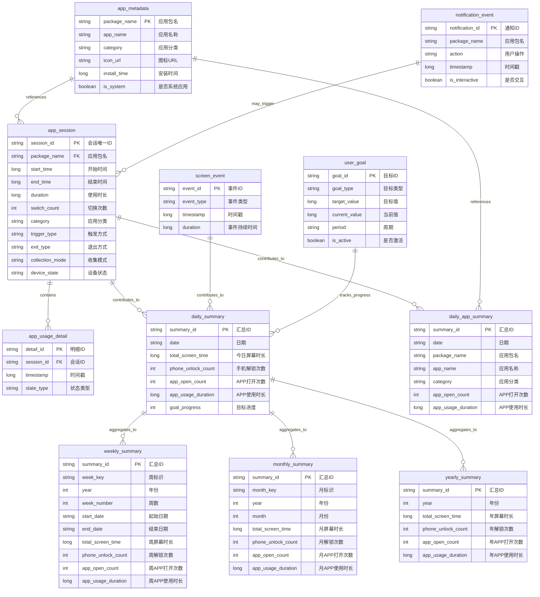
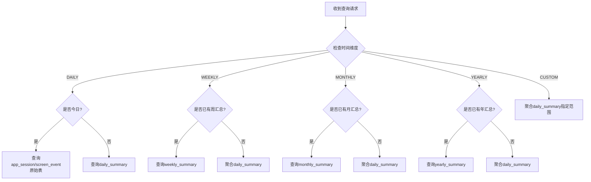
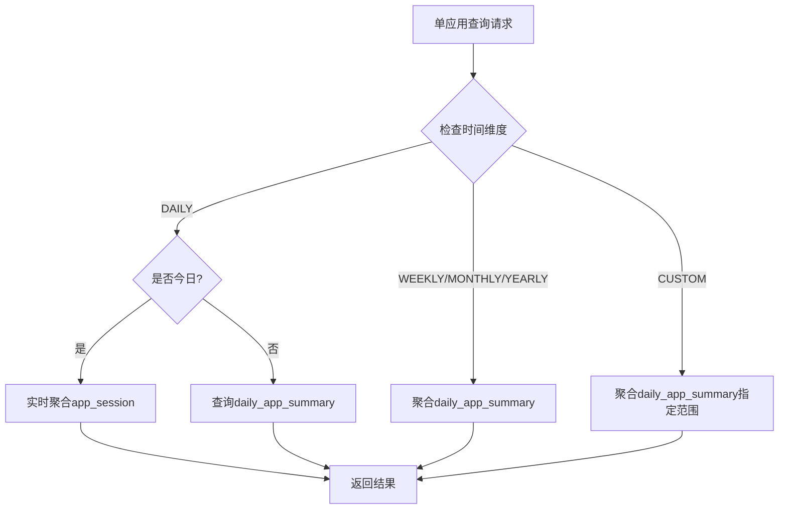
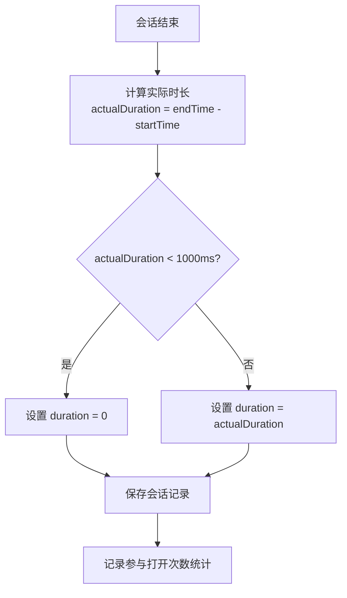
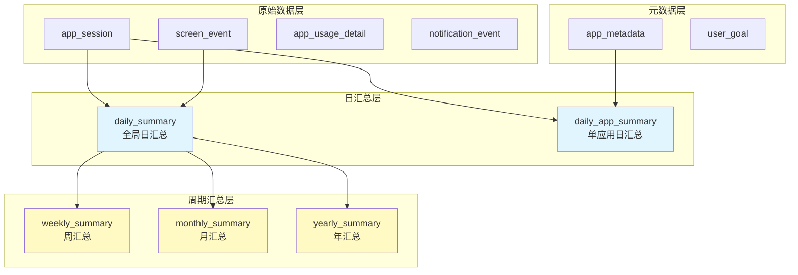
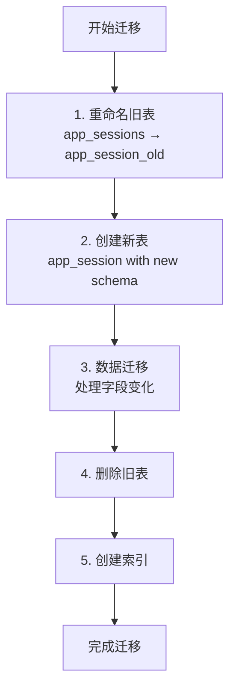
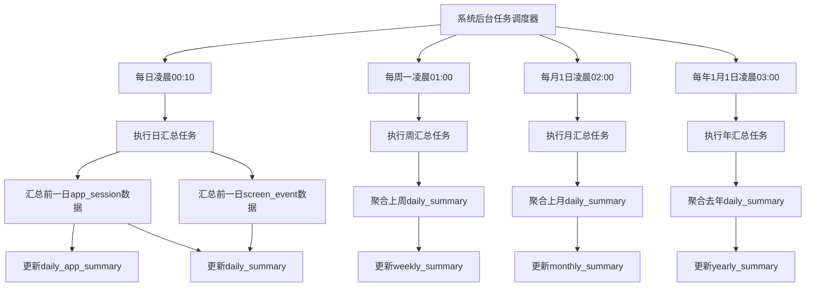
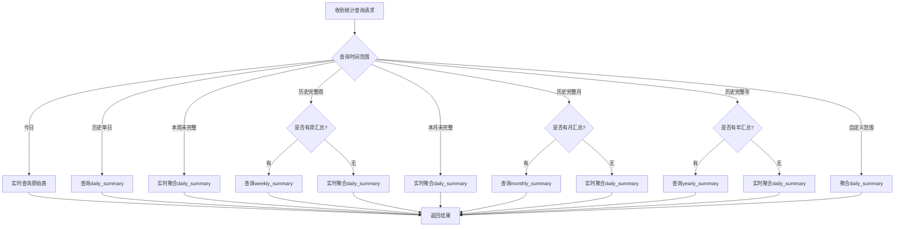

# 数据模型设计方案 v2.2

> **版本：** v2.2  
> **更新日期：** 2025-10-15  
> **文档状态：** 新增多时间维度统计支持，支持日/周/月/年/自定义维度查询  
> **权威来源：** 与《术语统一表 v2.3》完全同步

---

## 🎯 设计原则

1. **统一术语**：所有表名、字段名严格遵循《术语统一表 v2.1》
2. **单数表名**：所有表名使用单数形式（如 `app_session` 而非 `app_sessions`）
3. **行为记录**：无论使用时长多短，行为必须记录（保证统计准确）
4. **时长过滤**：短时会话duration设为0，但记录保留（用于准确计数）
5. **版本同步**：与术语表、技术架构文档保持完全一致

---

## 🏗️ 数据库架构

### ER图（实体关系图）



---

## 📊 详细表结构

### 1. 应用会话表（app_session）

**核心表，记录每次APP使用会话**

```sql
CREATE TABLE app_session (
    session_id TEXT PRIMARY KEY,
    package_name TEXT NOT NULL,
    app_name TEXT NOT NULL,
    category TEXT NOT NULL,
    start_time INTEGER NOT NULL,
    end_time INTEGER NOT NULL,
    duration INTEGER NOT NULL DEFAULT 0,
    switch_count INTEGER NOT NULL DEFAULT 1,
    trigger_type TEXT NOT NULL DEFAULT 'UNKNOWN',
    exit_type TEXT NOT NULL DEFAULT 'UNKNOWN',
    collection_mode TEXT NOT NULL DEFAULT 'STANDARD',
    device_state TEXT NOT NULL DEFAULT 'UNKNOWN',
    created_at INTEGER DEFAULT (strftime('%s', 'now') * 1000),
    updated_at INTEGER DEFAULT (strftime('%s', 'now') * 1000)
);

-- 索引
CREATE INDEX idx_app_session_package_name ON app_session(package_name);
CREATE INDEX idx_app_session_start_time ON app_session(start_time);
CREATE INDEX idx_app_session_date ON app_session(date(start_time/1000, 'unixepoch'));
CREATE INDEX idx_app_session_category ON app_session(category);
```

**重要修正说明：**
- ✅ **表名**：使用单数 `app_session`（不是 `app_sessions`）
- ✅ **字段**：删除了 `openCount` 字段（避免与全局统计混淆）
- ✅ **新增**：`switch_count` 字段表示本会话内的切换次数
- ✅ **统计**：全局"APP打开次数"通过 `COUNT(*)` 统计记录数
- ✅ **阈值**：duration=0的记录也参与计数（保证统计准确）

**字段详细说明：**

| 字段名 | SQL类型 | Kotlin类型 | 约束 | 说明 |
|--------|---------|-----------|------|------|
| session_id | TEXT | String (UUID) | PRIMARY KEY | 会话唯一标识，自动生成 |
| package_name | TEXT | String | NOT NULL | 应用包名，如 com.tencent.mm |
| app_name | TEXT | String | NOT NULL | 应用显示名称，如"微信" |
| category | TEXT | AppCategory(Enum) | NOT NULL | 应用分类枚举值 |
| start_time | INTEGER | Long | NOT NULL | 会话开始时间戳（毫秒） |
| end_time | INTEGER | Long | NOT NULL | 会话结束时间戳（毫秒） |
| duration | INTEGER | Long | DEFAULT 0 | 使用时长（毫秒），<1秒设为0 |
| switch_count | INTEGER | Int | DEFAULT 1 | 本会话内切换次数 |
| trigger_type | TEXT | TriggerType(Enum) | DEFAULT 'UNKNOWN' | 触发方式枚举值 |
| exit_type | TEXT | ExitType(Enum) | DEFAULT 'UNKNOWN' | 退出方式枚举值 |
| collection_mode | TEXT | PerformanceMode(Enum) | DEFAULT 'STANDARD' | 数据收集模式 |
| device_state | TEXT | DeviceState(Enum) | DEFAULT 'UNKNOWN' | 设备状态枚举值 |
| created_at | INTEGER | Long | 自动设置 | 记录创建时间戳 |
| updated_at | INTEGER | Long | 自动设置 | 记录更新时间戳 |


**业务规则方法：**
- `isValidSession()`: 判断是否有效会话（duration >= 1000ms）
- `getSessionDate()`: 获取会话日期（YYYY-MM-DD格式）

### 2. 应用使用明细表（app_usage_detail）

**记录会话内的状态变化**

```sql
CREATE TABLE app_usage_detail (
    detail_id TEXT PRIMARY KEY,
    session_id TEXT NOT NULL,
    timestamp INTEGER NOT NULL,
    state_type TEXT NOT NULL,
    FOREIGN KEY (session_id) REFERENCES app_session(session_id) ON DELETE CASCADE
);

CREATE INDEX idx_detail_session_id ON app_usage_detail(session_id);
CREATE INDEX idx_detail_timestamp ON app_usage_detail(timestamp);
```

**字段详细说明：**

| 字段名 | SQL类型 | 约束 | 说明 |
|--------|---------|------|------|
| detail_id | TEXT | PRIMARY KEY | 明细记录唯一标识（UUID） |
| session_id | TEXT | FOREIGN KEY | 关联app_session表 |
| timestamp | INTEGER | NOT NULL | 状态变化时间戳（毫秒） |
| state_type | TEXT | NOT NULL | 状态类型枚举值 |

**外键关系：**
- 引用表: app_session(session_id)
- 删除策略: CASCADE（删除会话时同步删除明细）

### 3. 屏幕事件表（screen_event）

**记录屏幕开关和解锁事件**

```sql
CREATE TABLE screen_event (
    event_id TEXT PRIMARY KEY,
    event_type TEXT NOT NULL,
    timestamp INTEGER NOT NULL,
    duration INTEGER DEFAULT 0,
    created_at INTEGER DEFAULT (strftime('%s', 'now') * 1000)
);

CREATE INDEX idx_screen_event_type ON screen_event(event_type);
CREATE INDEX idx_screen_event_timestamp ON screen_event(timestamp);
CREATE INDEX idx_screen_event_date ON screen_event(date(timestamp/1000, 'unixepoch'));
```

**字段详细说明：**

| 字段名 | SQL类型 | 约束 | 说明 |
|--------|---------|------|------|
| event_id | TEXT | PRIMARY KEY | 事件唯一标识（UUID） |
| event_type | TEXT | NOT NULL | 事件类型: SCREEN_ON/SCREEN_OFF/USER_PRESENT |
| timestamp | INTEGER | NOT NULL | 事件发生时间戳（毫秒） |
| duration | INTEGER | DEFAULT 0 | 事件持续时间（毫秒） |
| created_at | INTEGER | 自动设置 | 记录创建时间戳 |

**索引设计：**
- idx_screen_event_type: 事件类型索引
- idx_screen_event_timestamp: 时间戳索引
- idx_screen_event_date: 日期索引（用于按日查询）

### 4. 通知事件表（notification_event）

**记录通知和用户响应**

```sql
CREATE TABLE notification_event (
    notification_id TEXT PRIMARY KEY,
    package_name TEXT NOT NULL,
    action TEXT NOT NULL,
    timestamp INTEGER NOT NULL,
    is_interactive BOOLEAN DEFAULT FALSE,
    created_at INTEGER DEFAULT (strftime('%s', 'now') * 1000)
);

CREATE INDEX idx_notification_package ON notification_event(package_name);
CREATE INDEX idx_notification_timestamp ON notification_event(timestamp);
```

**字段详细说明：**

| 字段名 | SQL类型 | 约束 | 说明 |
|--------|---------|------|------|
| notification_id | TEXT | PRIMARY KEY | 通知唯一标识（UUID） |
| package_name | TEXT | NOT NULL | 应用包名 |
| action | TEXT | NOT NULL | 用户操作: POSTED/CLICKED/DISMISSED |
| timestamp | INTEGER | NOT NULL | 操作时间戳（毫秒） |
| is_interactive | BOOLEAN | DEFAULT FALSE | 是否为交互式通知 |
| created_at | INTEGER | 自动设置 | 记录创建时间戳 |

**索引设计：**
- idx_notification_package: 包名索引
- idx_notification_timestamp: 时间戳索引

### 5. 每日汇总表（daily_summary）

**预计算的每日统计数据**

```sql
CREATE TABLE daily_summary (
    summary_id TEXT PRIMARY KEY,
    date TEXT UNIQUE NOT NULL,
    total_screen_time INTEGER NOT NULL DEFAULT 0,
    phone_unlock_count INTEGER NOT NULL DEFAULT 0,
    app_open_count INTEGER NOT NULL DEFAULT 0,
    app_usage_duration INTEGER NOT NULL DEFAULT 0,
    goal_progress INTEGER DEFAULT 0,
    created_at INTEGER DEFAULT (strftime('%s', 'now') * 1000),
    updated_at INTEGER DEFAULT (strftime('%s', 'now') * 1000)
);

CREATE INDEX idx_daily_summary_date ON daily_summary(date);
```

**字段详细说明（四大核心指标）：**

| 字段名 | SQL类型 | 约束 | 说明 |
|--------|---------|------|------|
| summary_id | TEXT | PRIMARY KEY | 汇总记录唯一标识（UUID） |
| date | TEXT | UNIQUE NOT NULL | 日期（YYYY-MM-DD格式） |
| **total_screen_time** | INTEGER | DEFAULT 0 | 📱 今日屏幕时长（毫秒） |
| **phone_unlock_count** | INTEGER | DEFAULT 0 | 🔓 手机解锁次数 |
| **app_open_count** | INTEGER | DEFAULT 0 | 📲 APP打开次数 |
| **app_usage_duration** | INTEGER | DEFAULT 0 | 🔆 APP使用时长（毫秒） |
| goal_progress | INTEGER | DEFAULT 0 | 目标完成度（百分比） |
| created_at | INTEGER | 自动设置 | 记录创建时间戳 |
| updated_at | INTEGER | 自动设置 | 记录更新时间戳 |

**索引设计：**
- idx_daily_summary_date: 日期唯一索引

**用途说明：**
- 预计算的每日统计数据，提升查询性能
- 避免每次查询都进行聚合计算
- 支持历史数据快速检索

### 6. 用户目标表（user_goal）

**用户设定的使用目标**

```sql
CREATE TABLE user_goal (
    goal_id TEXT PRIMARY KEY,
    goal_type TEXT NOT NULL,
    target_value INTEGER NOT NULL,
    current_value INTEGER DEFAULT 0,
    period TEXT NOT NULL DEFAULT 'DAILY',
    is_active BOOLEAN DEFAULT TRUE,
    created_at INTEGER DEFAULT (strftime('%s', 'now') * 1000),
    updated_at INTEGER DEFAULT (strftime('%s', 'now') * 1000)
);

CREATE INDEX idx_user_goal_type ON user_goal(goal_type);
CREATE INDEX idx_user_goal_active ON user_goal(is_active);
```

**字段详细说明：**

| 字段名 | SQL类型 | 约束 | 说明 |
|--------|---------|------|------|
| goal_id | TEXT | PRIMARY KEY | 目标唯一标识（UUID） |
| goal_type | TEXT | NOT NULL | 目标类型枚举值 |
| target_value | INTEGER | NOT NULL | 目标值（毫秒或次数） |
| current_value | INTEGER | DEFAULT 0 | 当前值（实时更新） |
| period | TEXT | DEFAULT 'DAILY' | 统计周期: DAILY/WEEKLY/MONTHLY |
| is_active | BOOLEAN | DEFAULT TRUE | 是否激活 |
| created_at | INTEGER | 自动设置 | 记录创建时间戳 |
| updated_at | INTEGER | 自动设置 | 记录更新时间戳 |

**索引设计：**
- idx_user_goal_type: 目标类型索引
- idx_user_goal_active: 激活状态索引

**业务规则：**
- `getProgressPercentage()`: 计算完成度百分比 = (current_value * 100) / target_value

### 7. 每日应用汇总表（daily_app_summary）

**每日单应用统计数据**

```sql
CREATE TABLE daily_app_summary (
    summary_id TEXT PRIMARY KEY,
    date TEXT NOT NULL,
    package_name TEXT NOT NULL,
    app_name TEXT NOT NULL,
    category TEXT NOT NULL,
    app_open_count INTEGER NOT NULL DEFAULT 0,
    app_usage_duration INTEGER NOT NULL DEFAULT 0,
    created_at INTEGER DEFAULT (strftime('%s', 'now') * 1000),
    updated_at INTEGER DEFAULT (strftime('%s', 'now') * 1000),
    UNIQUE(date, package_name)
);

CREATE INDEX idx_daily_app_date ON daily_app_summary(date);
CREATE INDEX idx_daily_app_package ON daily_app_summary(package_name);
CREATE INDEX idx_daily_app_category ON daily_app_summary(category);
```

**字段详细说明：**

| 字段名 | SQL类型 | 约束 | 说明 |
|--------|---------|------|------|
| summary_id | TEXT | PRIMARY KEY | 汇总记录唯一标识（UUID） |
| date | TEXT | NOT NULL | 日期（YYYY-MM-DD格式） |
| package_name | TEXT | NOT NULL | 应用包名 |
| app_name | TEXT | NOT NULL | 应用名称 |
| category | TEXT | NOT NULL | 应用分类 |
| app_open_count | INTEGER | DEFAULT 0 | 该应用当日打开次数 |
| app_usage_duration | INTEGER | DEFAULT 0 | 该应用当日使用时长（毫秒） |
| created_at | INTEGER | 自动设置 | 记录创建时间戳 |
| updated_at | INTEGER | 自动设置 | 记录更新时间戳 |

**索引设计：**
- idx_daily_app_date: 日期索引
- idx_daily_app_package: 包名索引
- idx_daily_app_category: 分类索引
- UNIQUE约束: (date, package_name) 保证每日每应用唯一

**用途说明：**
- 支持单应用详细统计查询
- 提升单应用历史数据查询性能
- 支持应用排行榜功能

### 8. 每周汇总表（weekly_summary）

**每周全局统计数据**

```sql
CREATE TABLE weekly_summary (
    summary_id TEXT PRIMARY KEY,
    week_key TEXT UNIQUE NOT NULL,
    year INTEGER NOT NULL,
    week_of_year INTEGER NOT NULL,
    start_date TEXT NOT NULL,
    end_date TEXT NOT NULL,
    total_screen_time INTEGER NOT NULL DEFAULT 0,
    phone_unlock_count INTEGER NOT NULL DEFAULT 0,
    app_open_count INTEGER NOT NULL DEFAULT 0,
    app_usage_duration INTEGER NOT NULL DEFAULT 0,
    created_at INTEGER DEFAULT (strftime('%s', 'now') * 1000),
    updated_at INTEGER DEFAULT (strftime('%s', 'now') * 1000)
);

CREATE INDEX idx_weekly_year ON weekly_summary(year);
CREATE INDEX idx_weekly_key ON weekly_summary(week_key);
```

**字段详细说明：**

| 字段名 | SQL类型 | 约束 | 说明 |
|--------|---------|------|------|
| summary_id | TEXT | PRIMARY KEY | 汇总记录唯一标识（UUID） |
| week_key | TEXT | UNIQUE NOT NULL | 周标识（格式：YYYY-Www，如2024-W42） |
| year | INTEGER | NOT NULL | 年份（如2024） |
| week_of_year | INTEGER | NOT NULL | 年内第几周（1-53） |
| start_date | TEXT | NOT NULL | 周开始日期（周一，YYYY-MM-DD） |
| end_date | TEXT | NOT NULL | 周结束日期（周日，YYYY-MM-DD） |
| total_screen_time | INTEGER | DEFAULT 0 | 本周屏幕时长（毫秒） |
| phone_unlock_count | INTEGER | DEFAULT 0 | 本周解锁次数 |
| app_open_count | INTEGER | DEFAULT 0 | 本周APP打开次数 |
| app_usage_duration | INTEGER | DEFAULT 0 | 本周APP使用时长（毫秒） |
| created_at | INTEGER | 自动设置 | 记录创建时间戳 |
| updated_at | INTEGER | 自动设置 | 记录更新时间戳 |

**索引设计：**
- idx_weekly_year: 年份索引
- idx_weekly_key: 周标识唯一索引

**数据来源：**
- 基于 `daily_summary` 表聚合计算
- 每周一凌晨自动汇总上周数据

### 9. 每月汇总表（monthly_summary）

**每月全局统计数据**

```sql
CREATE TABLE monthly_summary (
    summary_id TEXT PRIMARY KEY,
    month_key TEXT UNIQUE NOT NULL,
    year INTEGER NOT NULL,
    month INTEGER NOT NULL,
    total_screen_time INTEGER NOT NULL DEFAULT 0,
    phone_unlock_count INTEGER NOT NULL DEFAULT 0,
    app_open_count INTEGER NOT NULL DEFAULT 0,
    app_usage_duration INTEGER NOT NULL DEFAULT 0,
    created_at INTEGER DEFAULT (strftime('%s', 'now') * 1000),
    updated_at INTEGER DEFAULT (strftime('%s', 'now') * 1000)
);

CREATE INDEX idx_monthly_year ON monthly_summary(year);
CREATE INDEX idx_monthly_key ON monthly_summary(month_key);
```

**字段详细说明：**

| 字段名 | SQL类型 | 约束 | 说明 |
|--------|---------|------|------|
| summary_id | TEXT | PRIMARY KEY | 汇总记录唯一标识（UUID） |
| month_key | TEXT | UNIQUE NOT NULL | 月标识（格式：YYYY-MM，如2024-10） |
| year | INTEGER | NOT NULL | 年份（如2024） |
| month | INTEGER | NOT NULL | 月份（1-12） |
| total_screen_time | INTEGER | DEFAULT 0 | 本月屏幕时长（毫秒） |
| phone_unlock_count | INTEGER | DEFAULT 0 | 本月解锁次数 |
| app_open_count | INTEGER | DEFAULT 0 | 本月APP打开次数 |
| app_usage_duration | INTEGER | DEFAULT 0 | 本月APP使用时长（毫秒） |
| created_at | INTEGER | 自动设置 | 记录创建时间戳 |
| updated_at | INTEGER | 自动设置 | 记录更新时间戳 |

**索引设计：**
- idx_monthly_year: 年份索引
- idx_monthly_key: 月标识唯一索引

**数据来源：**
- 基于 `daily_summary` 表聚合计算
- 每月1日凌晨自动汇总上月数据

### 10. 每年汇总表（yearly_summary）

**每年全局统计数据**

```sql
CREATE TABLE yearly_summary (
    summary_id TEXT PRIMARY KEY,
    year INTEGER UNIQUE NOT NULL,
    total_screen_time INTEGER NOT NULL DEFAULT 0,
    phone_unlock_count INTEGER NOT NULL DEFAULT 0,
    app_open_count INTEGER NOT NULL DEFAULT 0,
    app_usage_duration INTEGER NOT NULL DEFAULT 0,
    created_at INTEGER DEFAULT (strftime('%s', 'now') * 1000),
    updated_at INTEGER DEFAULT (strftime('%s', 'now') * 1000)
);

CREATE INDEX idx_yearly_year ON yearly_summary(year);
```

**字段详细说明：**

| 字段名 | SQL类型 | 约束 | 说明 |
|--------|---------|------|------|
| summary_id | TEXT | PRIMARY KEY | 汇总记录唯一标识（UUID） |
| year | INTEGER | UNIQUE NOT NULL | 年份（如2024） |
| total_screen_time | INTEGER | DEFAULT 0 | 本年屏幕时长（毫秒） |
| phone_unlock_count | INTEGER | DEFAULT 0 | 本年解锁次数 |
| app_open_count | INTEGER | DEFAULT 0 | 本年APP打开次数 |
| app_usage_duration | INTEGER | DEFAULT 0 | 本年APP使用时长（毫秒） |
| created_at | INTEGER | 自动设置 | 记录创建时间戳 |
| updated_at | INTEGER | 自动设置 | 记录更新时间戳 |

**索引设计：**
- idx_yearly_year: 年份唯一索引

**数据来源：**
- 基于 `daily_summary` 表聚合计算
- 每年1月1日凌晨自动汇总上年数据

### 11. 应用元数据表（app_metadata）

**缓存应用信息**

```sql
CREATE TABLE app_metadata (
    package_name TEXT PRIMARY KEY,
    app_name TEXT NOT NULL,
    category TEXT NOT NULL DEFAULT 'OTHER',
    icon_url TEXT,
    install_time INTEGER,
    is_system BOOLEAN DEFAULT FALSE,
    last_updated INTEGER DEFAULT (strftime('%s', 'now') * 1000)
);

CREATE INDEX idx_app_metadata_category ON app_metadata(category);
```

**字段详细说明：**

| 字段名 | SQL类型 | 约束 | 说明 |
|--------|---------|------|------|
| package_name | TEXT | PRIMARY KEY | 应用包名（唯一标识） |
| app_name | TEXT | NOT NULL | 应用显示名称 |
| category | TEXT | DEFAULT 'OTHER' | 应用分类枚举值 |
| icon_url | TEXT | 可为空 | 应用图标URL（本地或远程） |
| install_time | INTEGER | 可为空 | 应用安装时间戳 |
| is_system | BOOLEAN | DEFAULT FALSE | 是否为系统应用 |
| last_updated | INTEGER | 自动设置 | 元数据更新时间戳 |

**索引设计：**
- idx_app_metadata_category: 分类索引

**用途说明：**
- 缓存应用基本信息，减少系统查询
- 支持应用分类统计
- 识别系统应用和用户应用

---

## 🔍 查询示例

### 1. 今日四大核心指标查询

**查询1：今日APP打开次数**
```sql
-- 统计今日app_session表的记录条数
SELECT COUNT(*) 
FROM app_session 
WHERE date(start_time/1000, 'unixepoch') = date('now')
```
**说明**：每条记录代表一次APP切换到前台，直接统计记录数即可

**查询2：今日APP使用时长**
```sql
-- 汇总今日所有APP使用时长
SELECT COALESCE(SUM(duration), 0) 
FROM app_session 
WHERE date(start_time/1000, 'unixepoch') = date('now')
```
**说明**：包含所有记录（含duration=0），COALESCE处理无数据情况

**查询3：今日屏幕时长**
```sql
-- 统计SCREEN_ON事件的总时长
SELECT COALESCE(SUM(duration), 0) 
FROM screen_event 
WHERE event_type = 'SCREEN_ON' 
AND date(timestamp/1000, 'unixepoch') = date('now')
```
**说明**：需要通过SCREEN_ON/OFF事件配对计算，duration字段已预计算

**查询4：今日手机解锁次数**

```sql
-- 统计USER_PRESENT事件数量
SELECT COUNT(*) 
FROM screen_event 
WHERE event_type = 'USER_PRESENT' 
AND date(timestamp/1000, 'unixepoch') = date('now')
```
**说明**：每次解锁触发一次USER_PRESENT事件

### 2. 应用分类统计

**查询1：今日各分类使用统计**
```sql
-- 按分类汇总会话数和总时长
SELECT 
    category, 
    COUNT(*) as session_count,        -- 打开次数
    SUM(duration) as total_duration   -- 使用时长
FROM app_session 
WHERE date(start_time/1000, 'unixepoch') = date('now')
GROUP BY category
ORDER BY total_duration DESC
```
**结果示例**：
| category | session_count | total_duration |
|----------|--------------|----------------|
| 社交 | 45 | 7200000 (2小时) |
| 娱乐 | 23 | 5400000 (1.5小时) |
| 工具 | 18 | 1800000 (30分钟) |

**查询2：今日各分类打开次数排行**
```sql
-- 按打开次数排序
SELECT 
    category, 
    COUNT(*) as open_count
FROM app_session 
WHERE date(start_time/1000, 'unixepoch') = date('now')
GROUP BY category
ORDER BY open_count DESC
```

### 3. 多维度时间统计

**查询1：本周统计（基于周汇总表）**
```sql
-- 查询本周数据
SELECT * FROM weekly_summary 
WHERE week_key = :weekKey  -- 如 '2024-W42'
```

**查询2：本月统计（基于月汇总表）**
```sql
-- 查询本月数据
SELECT * FROM monthly_summary 
WHERE month_key = :monthKey  -- 如 '2024-10'
```

**查询3：本年统计（基于年汇总表）**
```sql
-- 查询本年数据
SELECT * FROM yearly_summary 
WHERE year = :year  -- 如 2024
```

**查询4：自定义时间范围统计（聚合日汇总表）**
```sql
-- 查询指定时间范围的汇总数据
SELECT 
    SUM(total_screen_time) as total_screen_time,
    SUM(phone_unlock_count) as phone_unlock_count,
    SUM(app_open_count) as app_open_count,
    SUM(app_usage_duration) as app_usage_duration
FROM daily_summary 
WHERE date BETWEEN :startDate AND :endDate
```

**多维度查询流程图**：



### 4. 单应用维度统计

**查询1：查询指定应用的历史数据（日维度）**
```sql
-- 查询微信最近7天的使用情况
SELECT 
    date,
    app_open_count,
    app_usage_duration
FROM daily_app_summary 
WHERE package_name = 'com.tencent.mm'
AND date >= date('now', '-7 days')
ORDER BY date DESC
```

**查询2：查询指定应用的周统计**
```sql
-- 基于daily_app_summary聚合本周数据
SELECT 
    SUM(app_open_count) as weekly_open_count,
    SUM(app_usage_duration) as weekly_usage_duration
FROM daily_app_summary 
WHERE package_name = :packageName
AND date BETWEEN :weekStartDate AND :weekEndDate
```

**查询3：应用排行榜（按使用时长）**
```sql
-- 查询今日应用使用时长TOP 10
SELECT 
    package_name,
    app_name,
    category,
    app_usage_duration
FROM daily_app_summary 
WHERE date = date('now')
ORDER BY app_usage_duration DESC
LIMIT 10
```

**单应用查询流程图**：



### 5. 分类维度统计

**查询1：查询指定分类的今日数据**
```sql
-- 查询社交类应用的今日统计
SELECT 
    SUM(app_open_count) as category_open_count,
    SUM(app_usage_duration) as category_usage_duration
FROM daily_app_summary 
WHERE category = 'SOCIAL'
AND date = date('now')
```

**查询2：查询分类的历史趋势**
```sql
-- 查询社交类应用最近7天的使用趋势
SELECT 
    date,
    SUM(app_open_count) as daily_open_count,
    SUM(app_usage_duration) as daily_usage_duration
FROM daily_app_summary 
WHERE category = :category
AND date >= date('now', '-7 days')
GROUP BY date
ORDER BY date
```

### 6. 最活跃应用统计

**查询1：今日最活跃应用（按时长排序）**
```sql
-- 统计每个APP的使用情况，按总时长排序
SELECT 
    package_name, 
    app_name, 
    category, 
    COUNT(*) as session_count,           -- 打开次数
    SUM(duration) as total_duration,     -- 总使用时长
    AVG(duration) as avg_duration        -- 平均单次时长
FROM app_session 
WHERE date(start_time/1000, 'unixepoch') = date('now')
GROUP BY package_name
ORDER BY total_duration DESC
LIMIT 10
```
**结果示例**：
| app_name | session_count | total_duration | avg_duration |
|----------|--------------|----------------|--------------|
| 微信 | 23 | 7200000 (2小时) | 313043 (5.2分钟) |
| 抖音 | 15 | 5400000 (1.5小时) | 360000 (6分钟) |

**查询2：今日最频繁打开应用（按次数排序）**
```sql
-- 按打开次数排序（不考虑时长）
SELECT 
    package_name, 
    app_name, 
    category, 
    COUNT(*) as open_count
FROM app_session 
WHERE date(start_time/1000, 'unixepoch') = date('now')
GROUP BY package_name
ORDER BY open_count DESC
LIMIT 10
```
**应用场景**：
- 查询1：查看哪些APP占用时间最多
- 查询2：查看哪些APP切换最频繁

---

## ⚠️ 数据一致性规则

### 1. 最小时长阈值处理

**原则：行为必须记录，时长可以过滤**

**处理逻辑**：


**核心要点**：
1. **必须保存记录**：无论使用时长多短，都要保存到数据库
2. **时长可以为0**：< 1秒的会话，duration字段设为0
3. **统计仍然准确**：
   - APP打开次数 = COUNT(*) ✅ （包含所有记录）
   - APP使用时长 = SUM(duration) ✅ （自动过滤0时长）

### 2. 统计查询一致性

**统计方式对比**：

| 统计指标 | SQL查询 | 是否包含duration=0记录 | 说明 |
|---------|---------|---------------------|------|
| APP打开次数 | `COUNT(*)` | ✅ 包含 | 所有记录都计数 |
| APP使用时长 | `SUM(duration)` | ✅ 自动忽略 | SUM自动跳过0值 |

**查询示例**：

**方式1：包含所有记录（推荐）**
```sql
-- APP打开次数
SELECT COUNT(*) FROM app_session WHERE date = :date

-- APP使用时长（自动过滤0时长）
SELECT SUM(duration) FROM app_session WHERE date = :date
```

**方式2：显式过滤短时会话（可选）**
```sql
-- 只统计有效会话
SELECT SUM(duration) FROM app_session 
WHERE date = :date AND duration >= 1000
```

**推荐使用方式1**，因为：
- 打开次数统计更准确
- SUM会自动跳过duration=0的记录
- 查询逻辑更简单

---

## 🔧 数据库升级策略

### 从v1.0到v2.1的迁移

**数据库版本管理**：

| 版本号 | 包含实体 | 更新内容 |
|--------|---------|---------|
| v1 | usage_tracking | 旧版本（待废弃） |
| v2 | 基础表 | 初始化新表结构 |
| v3 | 7张核心表 | 完整v2.1架构 |

**核心实体清单**：

| 序号 | 实体名 | 表名 | 数据类型 | 用途 |
|-----|--------|------|---------|------|
| 1 | AppSession | app_session | 原始数据 | 记录每次应用使用会话 |
| 2 | AppUsageDetail | app_usage_detail | 原始数据 | 记录会话内状态变化明细 |
| 3 | ScreenEvent | screen_event | 原始数据 | 记录屏幕开关和解锁事件 |
| 4 | NotificationEvent | notification_event | 原始数据 | 记录通知事件 |
| 5 | DailySummary | daily_summary | 日汇总 | 全局每日四大指标汇总 |
| 6 | DailyAppSummary | daily_app_summary | 日汇总 | 每日单应用统计数据 |
| 7 | WeeklySummary | weekly_summary | 周汇总 | 全局每周四大指标汇总 |
| 8 | MonthlySummary | monthly_summary | 月汇总 | 全局每月四大指标汇总 |
| 9 | YearlySummary | yearly_summary | 年汇总 | 全局每年四大指标汇总 |
| 10 | UserGoal | user_goal | 配置数据 | 用户设定的使用目标 |
| 11 | AppMetadata | app_metadata | 元数据 | 应用基本信息缓存 |

**数据分层架构**：



**迁移流程（v2 → v3）**：



**字段迁移映射**：
- session_id: 保持不变（若为空则生成UUID）
- open_count → switch_count (语义变更)
- 新增字段使用默认值

---

## 📅 数据汇总策略

### 汇总任务调度

**定时汇总任务流程**：



### 汇总任务详细说明

| 任务名称 | 执行时间 | 数据源 | 目标表 | 计算范围 | 备注 |
|---------|---------|-------|--------|---------|------|
| 日汇总任务 | 每日00:10 | app_session, screen_event | daily_summary, daily_app_summary | 前一日00:00-23:59 | 全局+单应用 |
| 周汇总任务 | 周一01:00 | daily_summary | weekly_summary | 上周一至上周日 | 仅全局汇总 |
| 月汇总任务 | 每月1日02:00 | daily_summary | monthly_summary | 上月1日至上月末 | 仅全局汇总 |
| 年汇总任务 | 1月1日03:00 | daily_summary | yearly_summary | 去年1月1日至12月31日 | 仅全局汇总 |

### 日汇总任务SQL示例

**1. 更新daily_summary（全局日汇总）**：
```sql
INSERT OR REPLACE INTO daily_summary (
    summary_id,
    date,
    total_screen_time,
    phone_unlock_count,
    app_open_count,
    app_usage_duration
)
SELECT 
    -- 使用UUID生成summary_id
    lower(hex(randomblob(16))),
    :targetDate,
    -- 计算屏幕时长
    COALESCE((SELECT SUM(duration) FROM screen_event 
              WHERE event_type = 'SCREEN_ON' 
              AND date(timestamp/1000, 'unixepoch') = :targetDate), 0),
    -- 计算解锁次数
    COALESCE((SELECT COUNT(*) FROM screen_event 
              WHERE event_type = 'USER_PRESENT' 
              AND date(timestamp/1000, 'unixepoch') = :targetDate), 0),
    -- 计算APP打开次数
    COALESCE((SELECT COUNT(*) FROM app_session 
              WHERE date(start_time/1000, 'unixepoch') = :targetDate), 0),
    -- 计算APP使用时长
    COALESCE((SELECT SUM(duration) FROM app_session 
              WHERE date(start_time/1000, 'unixepoch') = :targetDate), 0)
```

**2. 更新daily_app_summary（单应用日汇总）**：
```sql
INSERT OR REPLACE INTO daily_app_summary (
    summary_id,
    date,
    package_name,
    app_name,
    category,
    app_open_count,
    app_usage_duration
)
SELECT 
    lower(hex(randomblob(16))),
    :targetDate,
    package_name,
    app_name,
    category,
    COUNT(*) as app_open_count,
    COALESCE(SUM(duration), 0) as app_usage_duration
FROM app_session
WHERE date(start_time/1000, 'unixepoch') = :targetDate
GROUP BY package_name, app_name, category
```

### 周汇总任务SQL示例

```sql
INSERT OR REPLACE INTO weekly_summary (
    summary_id,
    week_key,
    year,
    week_of_year,
    start_date,
    end_date,
    total_screen_time,
    phone_unlock_count,
    app_open_count,
    app_usage_duration
)
SELECT 
    lower(hex(randomblob(16))),
    :weekKey,  -- 如 '2024-W42'
    :year,
    :weekOfYear,
    :startDate,  -- 周一日期
    :endDate,    -- 周日日期
    SUM(total_screen_time),
    SUM(phone_unlock_count),
    SUM(app_open_count),
    SUM(app_usage_duration)
FROM daily_summary
WHERE date BETWEEN :startDate AND :endDate
```

### 实时查询 vs 预计算查询

**查询策略决策流程**：



### 数据一致性保障

**汇总任务幂等性**：
- 使用 `INSERT OR REPLACE` 保证重复执行不会产生重复数据
- 使用UNIQUE约束（如date字段、week_key字段）防止重复
- 汇总任务失败可重新执行，不影响数据准确性

**汇总任务监控**：
- 记录每次汇总任务的执行状态
- 失败时触发告警并重试
- 定期检查汇总表的完整性

---

## 📚 相关文档

* [术语统一表 v2.1](./术语统一表.md) - 术语权威标准

* [核心指标定义说明](./核心指标定义说明.md) - 统计逻辑详细说明

* [技术说明_统计系统架构](./技术说明_统计系统架构.md) - 系统架构说明

* [前端UI设计方案 v2](./前端UI设计方案_v2.md) - UI设计规范

* [实现路线图 v2](./实现路线图_v2.md) - 开发计划

---

## 📝 版本历史

* **v2.2 (2025-10-15)**：

  * ✅ 新增多维度时间查询支持（日/周/月/年/自定义）

  * ✅ 新增4张汇总表：daily\_app\_summary, weekly\_summary, monthly\_summary, yearly\_summary

  * ✅ 新增StatsQuery查询参数模型

  * ✅ 新增TimeRange时间范围模型

  * ✅ 新增多维度查询示例和流程图

  * ✅ 新增数据汇总策略和任务调度说明

  * ✅ 新增数据分层架构图（原始数据→日汇总→周期汇总）

  * ✅ 完善查询示例：增加单应用、分类、多维度统计

  * ✅ 与术语统一表v2.3完全同步

* **v2.1 (2025-10-15)**：

  * ✅ 统一表名为单数形式（app\_session等）

  * ✅ 删除openCount字段，改用COUNT(\*)统计

  * ✅ 新增switch\_count字段表示会话内切换次数

  * ✅ 明确最小时长阈值处理逻辑（<1秒设为0）

  * ✅ 与术语统一表v2.1完全同步

* **v2.0 (2025-10-14)**：

  * 初始版本，引入四大核心指标

  * 设计AppSession等新数据结构

* **v1.0 (旧版)**：

  * 使用复数表名和openCount字段

  * 术语定义不统一

