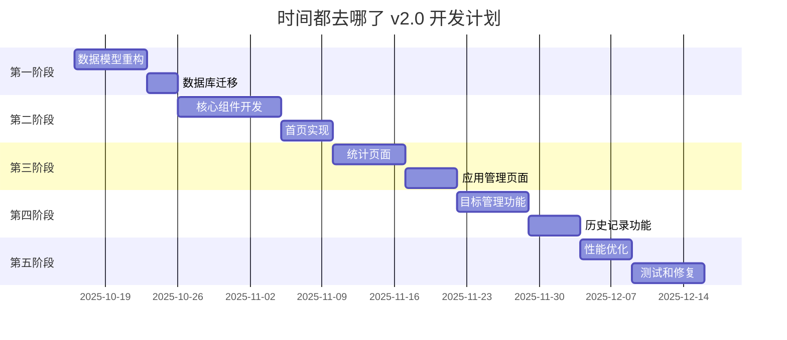
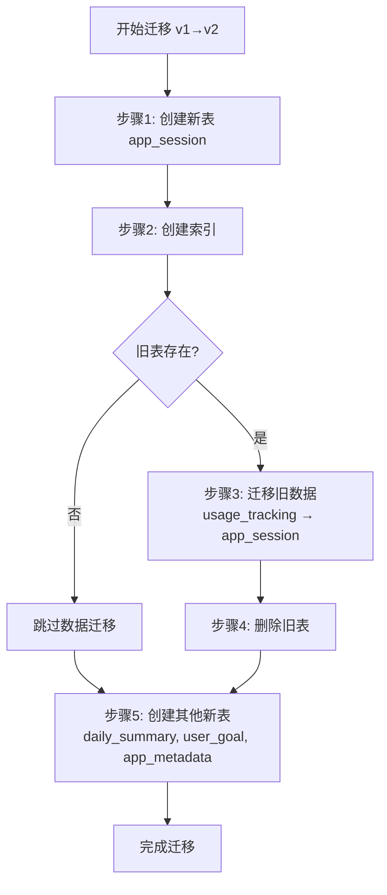
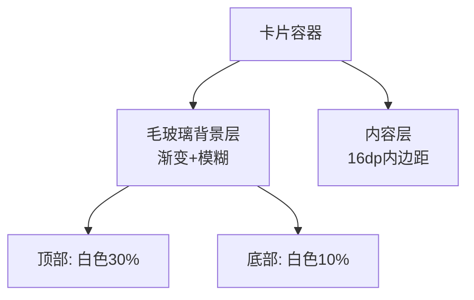
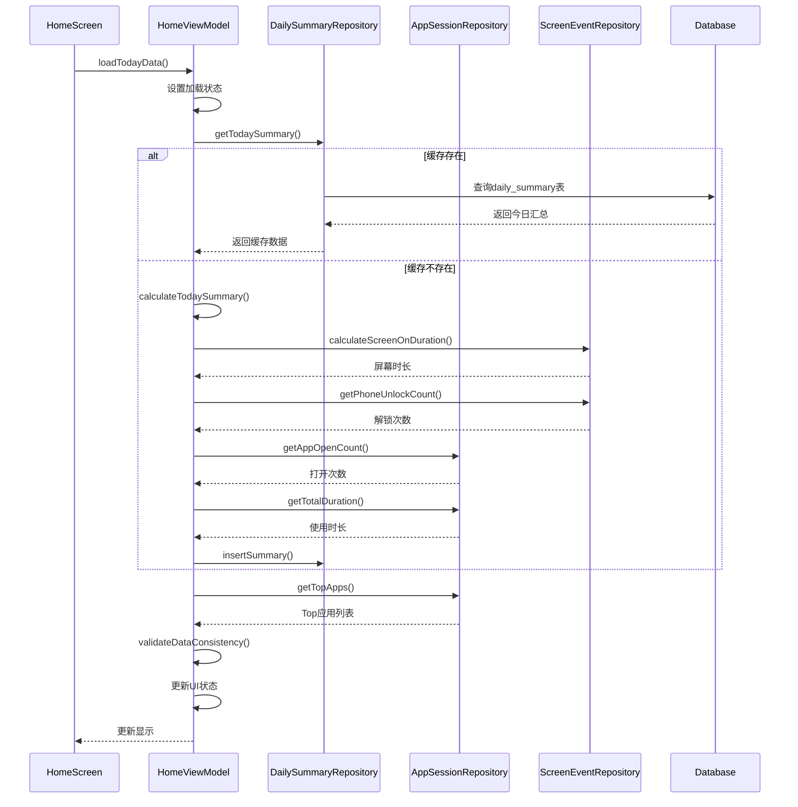
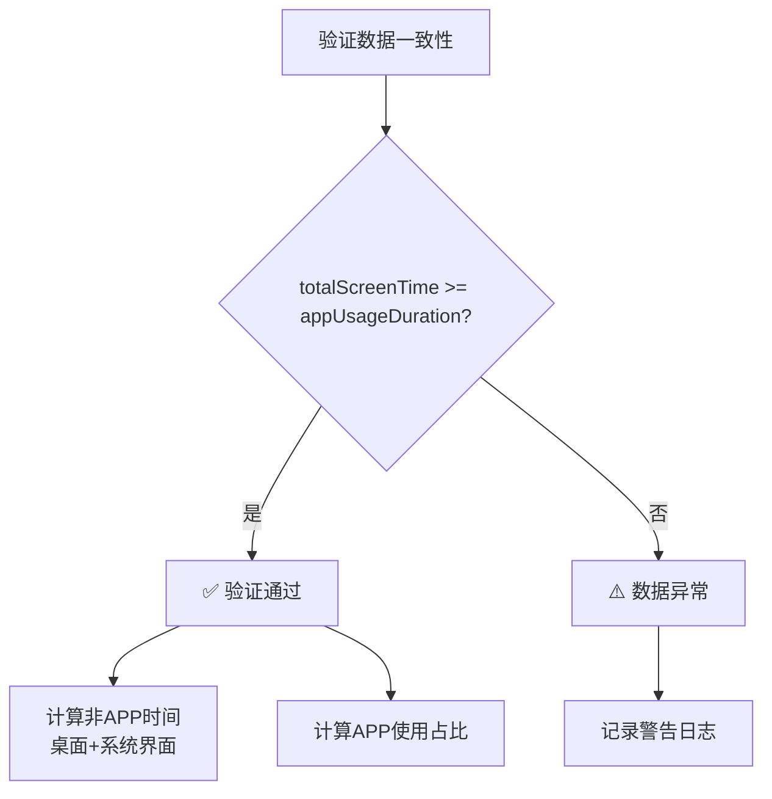

# 实现路线图 v2.1

## 📋 总体规划

### 项目阶段划分



---

## 🎯 第一阶段：数据基础重构（10天）

### Day 1-7: 数据模型重构

#### 任务清单
- [ ] 创建新的数据模型类
  - [ ] `AppSession.kt`
  - [ ] `AppUsageDetail.kt`
  - [ ] `ScreenEvent.kt`（改进版）
  - [ ] `NotificationEvent.kt`（改进版）
  - [ ] `DailySummary.kt`
  - [ ] `UserGoal.kt`
  - [ ] `AppMetadata.kt`

- [ ] 创建 DAO 接口
  - [ ] `AppSessionDao.kt`
  - [ ] `AppUsageDetailDao.kt`
  - [ ] `ScreenEventDao.kt`（改进版）
  - [ ] `NotificationEventDao.kt`（改进版）
  - [ ] `DailySummaryDao.kt`
  - [ ] `UserGoalDao.kt`
  - [ ] `AppMetadataDao.kt`

- [ ] 更新 Database 类
  - [ ] 添加新的实体
  - [ ] 定义数据库版本（version = 2）
  - [ ] 编写迁移策略

#### AppSession数据模型结构

**核心字段定义**：

| 字段名 | 数据类型 | 说明 | 约束 |
|-------|---------|------|------|
| session_id | String (UUID) | 会话唯一标识符 | 主键 |
| package_name | String | 应用包名 | 非空，有索引 |
| app_name | String | 应用显示名称 | 非空 |
| category | Enum | 应用分类 | 有索引 |
| start_time | Long | 会话开始时间戳（毫秒） | 非空，有索引 |
| end_time | Long | 会话结束时间戳（毫秒） | 非空 |
| duration | Long | 使用时长（毫秒） | ≥0，<1秒设为0但记录保留 |
| switch_count | Int | 本会话内切换次数 | 默认1 |
| trigger_type | Enum | 触发方式 | 默认UNKNOWN |
| exit_type | Enum | 退出方式 | 默认UNKNOWN |
| collection_mode | Enum | 数据收集模式 | 默认STANDARD |
| device_state | Enum | 设备状态 | 默认UNKNOWN |
| created_at | Long | 记录创建时间戳 | 系统自动设置 |
| updated_at | Long | 记录更新时间戳 | 系统自动设置 |

**索引设计**：
- 组合索引: (package_name, start_time)
- 唯一索引: session_id
- 单列索引: start_time, category

**业务规则**：
- 每次APP切换到前台时创建新会话记录
- duration < 1000ms 时设为0，但记录必须保留（用于统计打开次数）
- 会话日期通过 start_time 计算得出（YYYY-MM-DD格式）

### Day 8-10: 数据库迁移

#### 任务清单
- [ ] 编写迁移脚本
  - [ ] Migration 1 to 2
  - [ ] 数据转换逻辑
  - [ ] 索引重建

- [ ] 测试迁移
  - [ ] 单元测试
  - [ ] 集成测试
  - [ ] 性能测试

- [ ] 编写迁移文档

#### 数据库迁移流程

**迁移步骤（从v1到v2）**：



**迁移要点**：

1. **新表创建**
   - app_session: 应用会话表
   - daily_summary: 每日汇总表
   - user_goal: 用户目标表
   - app_metadata: 应用元数据表

2. **字段映射规则**
   - sessionId → session_id (使用原值或生成新UUID)
   - packageName → package_name
   - timestamp → start_time
   - endTimestamp → end_time (若无则用 start_time + duration)
   - category → 默认值 'OTHER'
   - 新增字段使用默认值

3. **索引创建**
   - idx_app_session_package_name: 单列索引
   - idx_app_session_start_time: 单列索引
   - idx_app_session_category: 单列索引
   - idx_daily_summary_date: 日期索引

4. **数据完整性保证**
   - 只迁移 duration >= 0 的记录
   - 使用COALESCE处理null值
   - 自动生成缺失的ID

---

## 🎨 第二阶段：核心组件和首页（15天）

### Day 11-20: 核心组件开发

#### 任务清单
- [ ] 设计系统组件
  - [ ] `Theme.kt` - 主题定义
  - [ ] `Color.kt` - 颜色系统
  - [ ] `Typography.kt` - 字体系统
  - [ ] `Shape.kt` - 形状系统

- [ ] 通用 UI 组件
  - [ ] `GlassmorphismCard.kt` - 毛玻璃卡片
  - [ ] `GradientCard.kt` - 渐变卡片
  - [ ] `CircularProgressCard.kt` - 圆形进度卡片
  - [ ] `ChartCard.kt` - 图表卡片基类

- [ ] 图表组件
  - [ ] `LineChart.kt` - 折线图
  - [ ] `BarChart.kt` - 柱状图
  - [ ] `PieChart.kt` - 饼图
  - [ ] `HeatmapCalendar.kt` - 热力图日历

#### UI组件设计规范

**GlassmorphismCard（毛玻璃卡片）组件**

**设计参数**：
- elevation: 阴影高度，默认 8dp
- cornerRadius: 圆角半径，默认 20dp
- containerColor: 容器颜色，半透明 (alpha = 0.7)
- 渐变效果: 垂直渐变，从白色30%透明度到10%透明度
- blur: 模糊半径 10dp

**视觉效果层次**：


**应用场景**：
- 统计卡片
- 数据展示区域
- 浮动面板

### Day 21-25: 首页实现

#### 任务清单

**核心指标实现（优先）**
- [ ] 实现四大核心指标计算
  - [ ] 📱 今日屏幕时长：SCREEN_ON/OFF配对计算
  - [ ] 🔓 手机解锁次数：USER_PRESENT事件统计
  - [ ] 📲 APP打开次数：app_session记录计数
  - [ ] 🔆 APP使用时长：app_session duration总和
  - [ ] 数据一致性验证

**UI组件实现**
- [ ] HomeScreen 主界面
  - [ ] 问候卡片
  - [ ] 今日屏幕时长主卡片（第一指标）
  - [ ] 快速统计卡片（双列）
    - [ ] 左：手机解锁次数卡片
    - [ ] 右：APP打开次数卡片
  - [ ] APP使用时长卡片（单列）
  - [ ] 最常用应用列表
  - [ ] 目标进度卡片

**数据层实现**
- [ ] HomeViewModel
  - [ ] 核心指标数据查询
  - [ ] 昨日对比数据查询
  - [ ] 状态管理（HomeUiState）
  - [ ] 数据验证逻辑
  - [ ] 用户操作处理

- [ ] Repository层
  - [ ] 屏幕时长计算Repository方法
  - [ ] 手机解锁次数统计Repository方法
  - [ ] APP打开次数统计Repository方法
  - [ ] APP使用时长汇总Repository方法

**动画和交互**
- [ ] 动画效果
  - [ ] 进入动画
  - [ ] 进度条动画
  - [ ] 点击反馈
  - [ ] 下拉刷新

#### HomeViewModel业务逻辑设计

**数据加载流程**：



**核心指标计算流程**：

1. **📱 屏幕时长计算**
   - 数据源: screen_event表
   - 方法: SCREEN_ON/OFF事件配对
   - 公式: SUM(SCREEN_OFF时间 - SCREEN_ON时间)

2. **🔓 解锁次数统计**
   - 数据源: screen_event表
   - 方法: USER_PRESENT事件计数
   - 公式: COUNT(WHERE event_type = 'USER_PRESENT')

3. **📲 APP打开次数**
   - 数据源: app_session表
   - 方法: 记录条数统计
   - 公式: COUNT(*)

4. **🔆 APP使用时长**
   - 数据源: app_session表
   - 方法: 时长字段求和
   - 公式: SUM(duration)

**数据一致性验证规则**：



**状态管理**：
- isLoading: 加载状态
- error: 错误信息
- 四大核心指标字段
- topApps: Top应用列表
- goals: 用户目标
- yesterdayComparison: 与昨日对比

---

## 📊 第三阶段：统计和应用管理（12天）

### Day 26-32: 统计页面

#### 任务清单
- [ ] StatisticsScreen 主界面
  - [ ] 时间段选择器
  - [ ] 趋势折线图
  - [ ] 分类饼图
  - [ ] 小时分布柱状图
  - [ ] 详细数据表

- [ ] StatisticsViewModel
  - [ ] 多维度数据查询
  - [ ] 图表数据转换
  - [ ] 数据对比逻辑

- [ ] 图表交互
  - [ ] 点击查看详情
  - [ ] 缩放和平移
  - [ ] 数据点高亮

### Day 33-37: 应用管理页面

#### 任务清单
- [ ] AppsScreen 主界面
  - [ ] 搜索和过滤
  - [ ] 分类展示
  - [ ] 应用列表
  - [ ] 黑名单管理

- [ ] AppDetailScreen 详情页
  - [ ] 应用详细统计
  - [ ] 使用时间轴
  - [ ] 目标设置
  - [ ] 限制设置

- [ ] AppsViewModel
  - [ ] 应用数据查询
  - [ ] 分类管理
  - [ ] 黑名单逻辑

---

## 🎯 第四阶段：目标和历史（12天）

### Day 38-44: 目标管理功能

#### 任务清单
- [ ] GoalsScreen 主界面
  - [ ] 目标列表
  - [ ] 目标进度卡片
  - [ ] 创建目标对话框
  - [ ] 编辑目标对话框

- [ ] GoalsViewModel
  - [ ] 目标CRUD操作
  - [ ] 进度计算
  - [ ] 提醒逻辑

- [ ] 提醒系统
  - [ ] 目标达成提醒
  - [ ] 超标警告
  - [ ] 休息提醒

### Day 45-49: 历史记录功能

#### 任务清单
- [ ] HistoryScreen 主界面
  - [ ] 日历热力图
  - [ ] 时间轴视图
  - [ ] 数据导出
  - [ ] 数据清理

- [ ] HistoryViewModel
  - [ ] 历史数据查询
  - [ ] 导出逻辑
  - [ ] 数据统计

- [ ] 导出功能
  - [ ] CSV 导出
  - [ ] PDF 导出
  - [ ] JSON 导出

---

## ⚡ 第五阶段：优化和测试（12天）

### Day 50-54: 性能优化

#### 任务清单
- [ ] 数据库优化
  - [ ] 查询性能分析
  - [ ] 索引优化
  - [ ] 批量操作优化

- [ ] UI 性能优化
  - [ ] LazyColumn 优化
  - [ ] 图表渲染优化
  - [ ] 内存占用优化

- [ ] 后台任务优化
  - [ ] WorkManager 调度
  - [ ] 电池优化
  - [ ] 数据收集策略

#### 性能指标

| 指标 | 目标 | 当前 | 状态 |
|------|------|------|------|
| 应用启动时间 | < 1.5s | - | - |
| 首页加载时间 | < 300ms | - | - |
| 图表渲染时间 | < 200ms | - | - |
| 内存占用 | < 150MB | - | - |
| 数据库查询 | < 50ms | - | - |
| 电池消耗 | < 2%/天 | - | - |

### Day 55-61: 测试和修复

#### 任务清单
- [ ] 单元测试
  - [ ] ViewModel 测试
  - [ ] Repository 测试
  - [ ] DAO 测试
  - [ ] Util 测试

- [ ] UI 测试
  - [ ] Compose 测试
  - [ ] 导航测试
  - [ ] 交互测试

- [ ] 集成测试
  - [ ] 端到端测试
  - [ ] 性能测试
  - [ ] 压力测试

- [ ] Bug 修复
  - [ ] 已知问题修复
  - [ ] 测试发现问题修复
  - [ ] 用户反馈修复

#### 测试覆盖率目标

| 模块 | 目标覆盖率 | 当前覆盖率 | 状态 |
|------|-----------|-----------|------|
| ViewModel | > 80% | - | - |
| Repository | > 90% | - | - |
| DAO | > 95% | - | - |
| Util | > 90% | - | - |
| UI Components | > 60% | - | - |

---

## 📦 第六阶段：发布准备（7天）

### Day 62-68: 发布准备

#### 任务清单
- [ ] 代码审查
  - [ ] 代码质量检查
  - [ ] 安全审查
  - [ ] 性能审查

- [ ] 文档编写
  - [ ] 用户手册
  - [ ] 开发文档
  - [ ] API 文档

- [ ] 版本打包
  - [ ] 签名配置
  - [ ] 混淆配置
  - [ ] 版本号设置

- [ ] 应用商店准备
  - [ ] 应用截图
  - [ ] 应用描述
  - [ ] 隐私政策

---

## 🔄 持续迭代计划

### v2.1（1个月后）
- [ ] 通知历史功能完善
- [ ] 应用分类自定义
- [ ] 数据备份恢复
- [ ] 主题自定义

### v2.2（2个月后）
- [ ] 小组件支持
- [ ] 快捷方式
- [ ] 语音播报
- [ ] 家长控制模式

### v2.3（3个月后）
- [ ] 数据分析报告
- [ ] AI 使用建议
- [ ] 习惯养成功能
- [ ] 社区功能

---

## 📊 项目进度跟踪

### 总体进度
```
阶段一 ░░░░░░░░░░░░░░░░░░░░  0% (0/10天)
阶段二 ░░░░░░░░░░░░░░░░░░░░  0% (0/15天)
阶段三 ░░░░░░░░░░░░░░░░░░░░  0% (0/12天)
阶段四 ░░░░░░░░░░░░░░░░░░░░  0% (0/12天)
阶段五 ░░░░░░░░░░░░░░░░░░░░  0% (0/12天)
阶段六 ░░░░░░░░░░░░░░░░░░░░  0% (0/7天)

总进度  ░░░░░░░░░░░░░░░░░░░░  0% (0/68天)
```

### 关键里程碑
- [ ] 2025-10-22：数据库迁移完成
- [ ] 2025-11-06：首页功能完成
- [ ] 2025-11-18：核心功能完成
- [ ] 2025-11-30：优化和测试完成
- [ ] 2025-12-07：发布v2.0版本

---

## 🚀 快速开始

### 第一天要做的事

1. **创建分支**
   ```bash
git checkout -b feature/v2-data-model
```

2. **创建目录结构**
   ```
app/src/main/java/com/example/time/
   ├── data/
   │   ├── model/
   │   │   └── v2/           # 新版数据模型
   │   ├── dao/
   │   │   └── v2/           # 新版DAO
   │   └── database/
   │       └── Migrations.kt # 迁移脚本
```

3. **创建第一个数据模型**
   - 复制 `数据模型设计方案_v2.md` 中的 `AppSession` 定义
   - 创建 `app/src/main/java/com/example/time/data/model/v2/AppSession.kt`
   - 添加必要的枚举类型

4. **编写第一个测试**
   - 测试AppSession数据类的创建
   - 验证必要字段不为空
   - 测试数据验证逻辑

---

## 💡 开发建议

### 代码规范
- 遵循 Kotlin 官方代码风格
- 使用有意义的变量和函数名
- 添加必要的注释和文档
- 保持函数简洁（< 30行）

### Git 提交规范
```
feat: 添加AppSession数据模型
fix: 修复数据迁移bug
docs: 更新API文档
style: 代码格式化
refactor: 重构数据查询逻辑
test: 添加单元测试
chore: 更新依赖版本
```

### 开发工具
- **IDE**: Android Studio Hedgehog或更新版本
- **Kotlin**: 1.9.0+
- **Gradle**: 8.0+
- **最低SDK**: 33 (Android 13)
- **目标SDK**: 34 (Android 14)

---

## 📞 技术支持

遇到问题时：
1. 查看设计文档
2. 检查代码注释
3. 运行测试用例
4. 查看日志输出
5. 提交 Issue

祝开发顺利！🎉

---

## 📝 版本历史

**v2.1 (2025-10-15)**
- ✅ 修正AppSession数据模型（删除openCount等废弃字段）
- ✅ 简化DailySummary结构（只保留四大核心指标）
- ✅ 修正数据库迁移脚本
- ✅ 统一数据验证逻辑（引用技术说明文档）
- ✅ 所有代码示例与《数据模型设计方案_v2.md》和《术语统一表v2.1》完全同步

**v2.0 (2025-10-14)**
- 初始版本
- 定义开发阶段和任务清单
- 提供代码示例和最佳实践

**最后审查日期：** 2025-10-15
